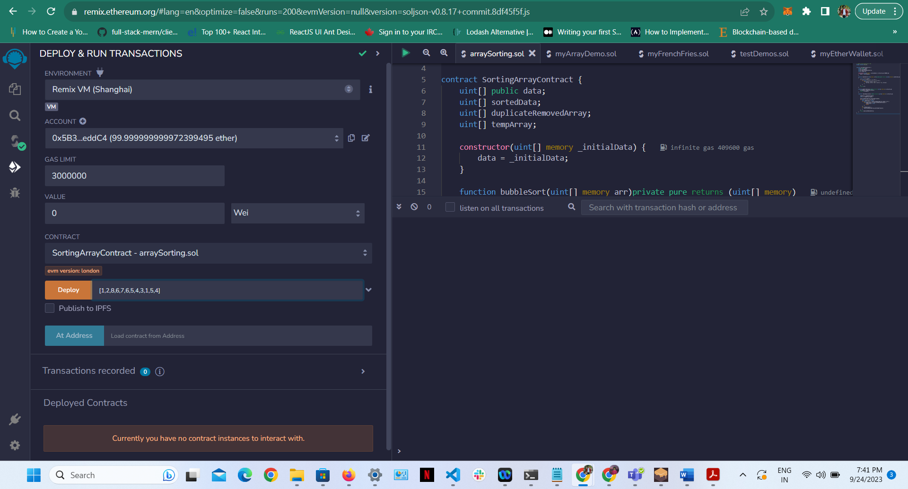
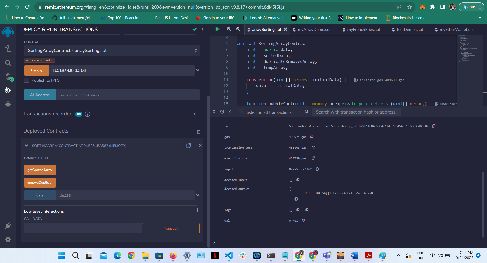
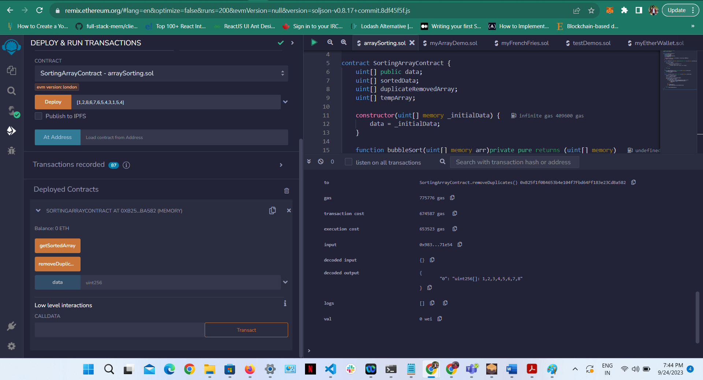

# BCDV-4028-LAB1
1-Initialize array while deploying contract 

2-Click on getSortedArray and get sorted array in output

3 - Click on Remove dulpictaes and get array with duplicate removed array

